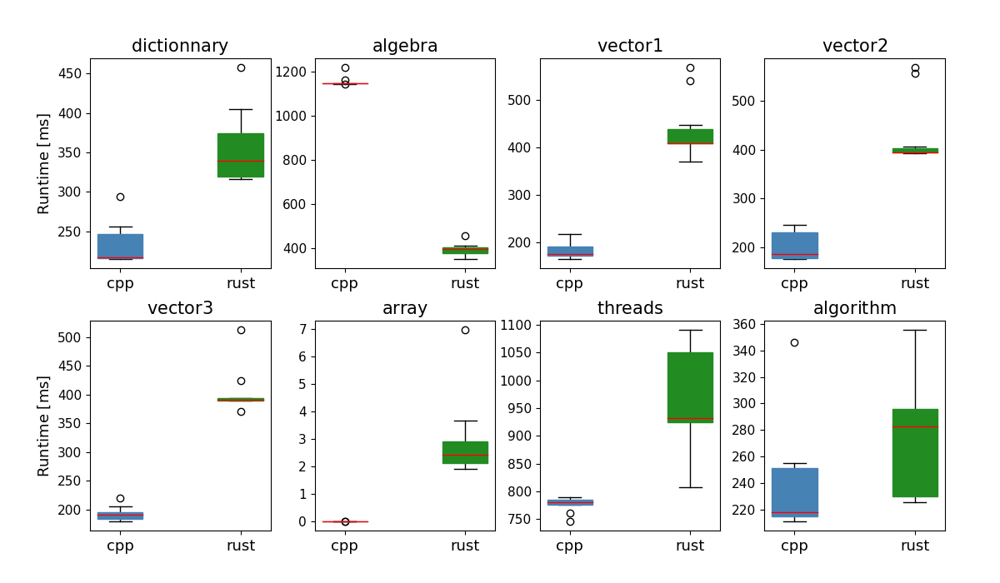

# Rust_Cpp_arena

Playground to learn Rust and compare several features with C++. The corresponding source code are separated in two projects, `cpp` and `rust`. They implement the same benchmark programs in `src/benchmarks` and the main program in `main.rs/main.cpp`.

## Run the benchmarks

``` bash
    python benchmark.py
```
This will launch the pre-defined benchmarks and plot the results.

### Example of benchmark results


## Add new benchmarks

You should implement the benchmark, including the main benchmark function (should take no parameter and return nothing) in `src/benchmarks/` both in the `cpp` and `rust` projects.

Then, modify the `src/tools/config.rs` and `src/tools/config.cpp` files to add the benchmark function in the `rust` and `cpp` projects respectively, by choosing one particular name. This gives for the `rust` configuration:
``` rust
    benchmarks: HashMap::from([
        ...,
        ("benchmark_name", &benchmark_rust_func as &dyn Fn() -> ()),
    ])
```
And the `cpp` counter-part:
``` cpp
    std::unordered_map<std::string, std::function<void()>> benchmarks = {
        ...,
        {"benchmark_name", benchmark_cpp_func},
    };
```

Finally, add the benchmark in the `BENCHMARKS` variable of the `benchmark.py` file, completing the list a tuple:
``` python
    BENCHMARKS = [
        ...,
        ("benchmark_name", "benchmark_output_file_name", <n_iter(int)>)
    ]
```
with `n_iter` the number of iterations to repeat the benchmark.
